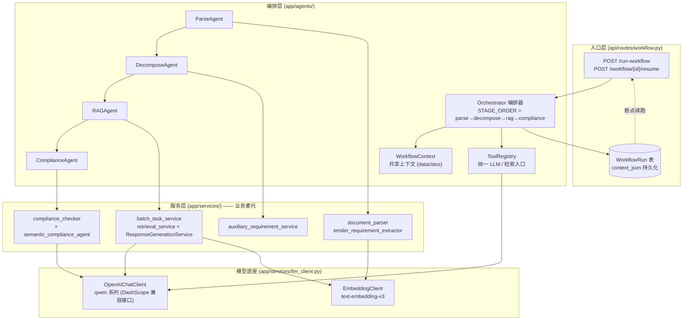
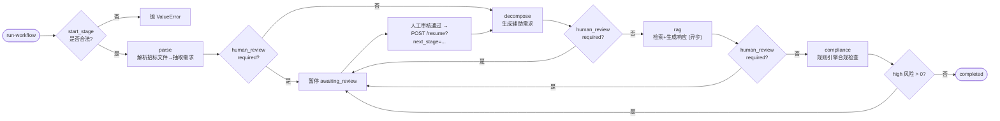
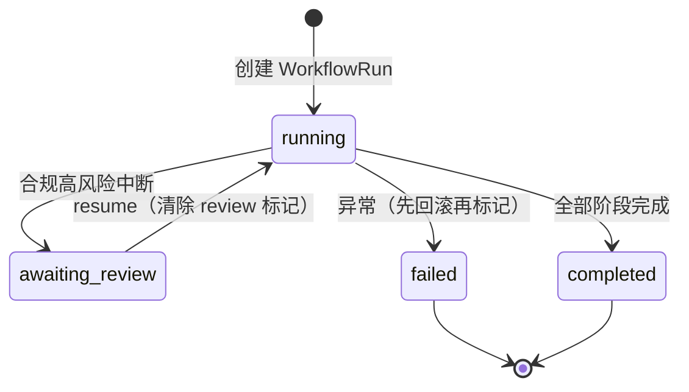
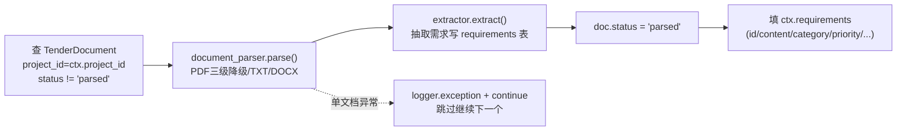
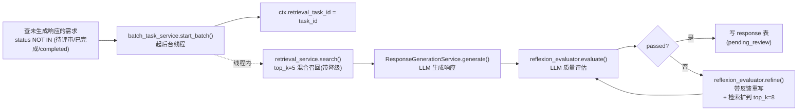
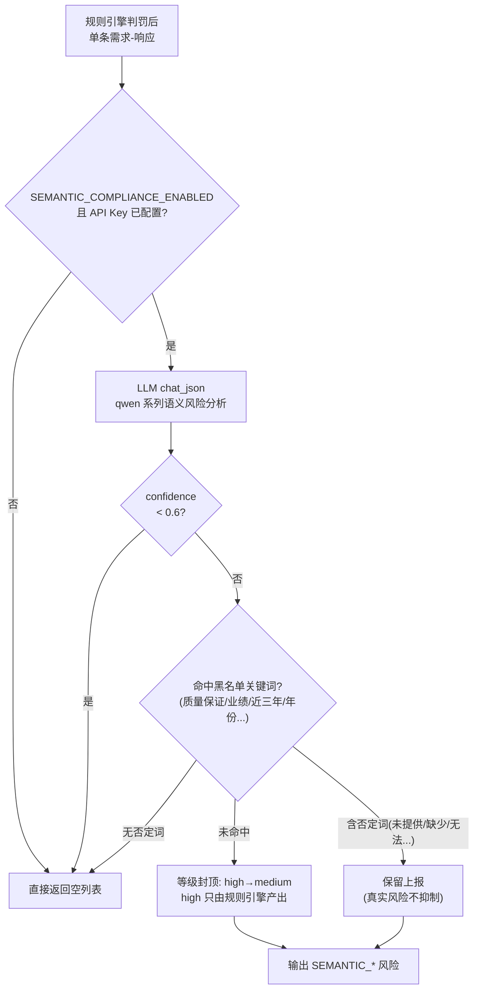

# BidFlow Agent 架构详解

> 版本：2026-08-06 · 基于 `backend/app/agents/` 与 `backend/app/services/` 实际代码梳理
> 定位：系统采用**编排式多 Agent（Orchestrator Pattern）**架构，另有一条独立的语义合规 Agent 通道。

---

## 1. 架构总览

BidFlow 中存在**两套 Agent 体系**：

| 体系 | 位置 | 角色 | 运行方式 |
|---|---|---|---|
| **主编排链路** | `backend/app/agents/` | Orchestrator + 4 个 Sub-Agent | 固定流水线 `parse → decompose → rag → compliance`，后台线程执行，支持人工审核中断/恢复 |
| **独立语义 Agent** | `backend/app/services/semantic_compliance_agent.py` | SemanticComplianceAgent | 不参与编排，作为合规检查的"后置增强"，独立按条调用 |

设计哲学（`agents/__init__.py` 原注释）：**Agent 均为薄壳，只做编排与状态传递，业务逻辑全部委托复用现有 Service，不重写。**



---

## 2. 核心机制

### 2.1 WorkflowContext —— 阶段间共享状态

定义于 `app/agents/base.py`，是贯穿全流水线的**单一数据载体**：

```python
@dataclass
class WorkflowContext:
    project_id: int
    owner_id: str
    stages_done: List[str]              # 已完成的阶段（Orchestrator 统一追加）
    requirements: List[Dict]            # parse 阶段产出，下游消费
    retrieval_task_id: Optional[str]    # rag 阶段的异步批处理任务号
    compliance_issues: List[Dict]       # compliance 阶段产出
    human_review_required: bool         # 人工审核开关（合规高风险置 True）
    review_reason: str
    metadata: Dict[str, Any]
```

**数据流**：`ParseAgent` 填 `requirements` → `RAGAgent` 填 `retrieval_task_id` → `ComplianceAgent` 填 `compliance_issues`，一个对象贯穿全程。

### 2.2 ToolRegistry —— 统一能力入口

所有 Agent 通过 `ToolRegistry` 获取模型能力，避免各自实例化：

```python
class ToolRegistry:
    def llm(self):
        """返回 LLM 客户端（lazy 实例化）"""
        return OpenAIChatClient(api_key=..., model=settings.LLM_MODEL_NAME)
    # self.retrieval_service 也挂在注册表上
```

### 2.3 编排调度与人工审核中断（Human-in-the-loop）

`app/agents/orchestrator.py` 顺序调用各 Agent，**发现高风险合规问题立即中断**：

```python
for stage_name in self.STAGE_ORDER[start_index:]:
    new_ctx = agent.run(ctx, db)
    new_ctx.stages_done.append(stage_name)
    if new_ctx.human_review_required:   # ← ComplianceAgent 置位
        break                            # 立即中断后续阶段
```



**WorkflowRun 状态机**：



---

## 3. 四个 Sub-Agent 详解

### 3.1 ParseAgent —— 招标文件解析



- 遍历是 **DB 驱动**（`db.query(...).filter(...).all()`），非文件系统递归
- 单文档失败**静默跳过**（`except Exception: continue`），不标记 failed，下次 run 会重试

### 3.2 DecomposeAgent —— 需求分解

- 委托 `auxiliary_requirement_service.generate(db, project_id)` 生成辅助需求
- 数量记入 `ctx.metadata["decomposed_count"]`

### 3.3 RAGAgent —— 检索增强生成（异步）+ Reflexion 质量闭环



- **编排不等待**：批处理任务逐步递进写库，编排侧只需拿到 `task_id`
- 批处理实现：`threading + 内存字典`（单实例足够，无 Celery/Redis 依赖）
- **Reflexion 质量闭环（2026-08-06 新增）**：生成后 LLM 评估响应是否充分满足招标要求；不达标则带评估反馈重写（重写轮检索扩到 `top_k=8` 提供更多素材），最多 `REFLEXION_MAX_ROUNDS`（默认 2）轮。评估/重写任何失败**静默降级为通过**，绝不阻断生成链路。配置：`REFLEXION_ENABLED` / `REFLEXION_MAX_ROUNDS` / `REFLEXION_RETRY_TOP_K`
- 实现位置在 `batch_task_service._process_one`（公共通道），**RAGAgent 与主 UI 批量生成两条路径同时受益**

### 3.4 ComplianceAgent —— 合规检查

- 查项目全部需求 → `build_snapshots_from_requirements()` 构建快照（取每条需求**最新响应**的 status/content）
- 委托 `ComplianceChecker().check(snapshots)`（**确定性规则引擎**）
- 产出 `ctx.compliance_issues`；**high 风险 > 0 → 置 `human_review_required=True` 中断流水线**

---

## 4. 入口与持久化（workflow.py 路由）

| 接口 | 作用 |
|---|---|
| `POST /{project_id}/run-workflow?start_stage=parse` | 创建 `WorkflowRun`（running）→ 启动 daemon 线程执行编排，立即返回 `{run_id, status}` |
| `GET /{project_id}/workflow/{run_id}` | 查询运行状态与上下文摘要 |
| `POST /{project_id}/workflow/{run_id}/resume?next_stage=rag` | 仅 `awaiting_review` 状态可调用，清除 review 标记后从指定阶段续跑 |
| `GET /{project_id}/workflow-runs` | 列出项目全部运行记录 |

**关键实现细节**：

- **后台线程自建独立数据库会话**：`create_engine(sync_url)` + 独立 `sessionmaker`，不占用主请求的 DB 会话（长任务隔离）
- `finally` 中 `local_engine.dispose()` 释放连接池，避免每次运行泄漏一池连接
- 上下文序列化 JSON 存 `WorkflowRun.context_json` → **断点续跑**（resume 时从 JSON 恢复 ctx）
- 状态落库：`running / awaiting_review / completed / failed`，`current_stage = stages_done[-1]`

---

## 5. 独立通道：SemanticComplianceAgent

不参与编排，在**规则引擎之后**对每条「需求-响应」调用 LLM 做语义级风险检测，带四层防御：



| 防御层 | 规则 | 目的 |
|---|---|---|
| 1. 开关与 Key 检查 | `SEMANTIC_COMPLIANCE_ENABLED` + `DASHSCOPE_API_KEY` | 未配置直接跳过 |
| 2. 置信度过滤 | `confidence < 0.6` 丢弃 | LLM 不确定的不报 |
| 3. 黑名单抑制 | 命中"质量保证/业绩案例/近三年/年份"等词丢弃；**含否定词（未提供/缺少/无法）不抑制** | 防时间/业绩/质保类误报 |
| 4. 等级封顶 | 语义 Agent 最高 `medium`，`high` 仅由规则引擎产出 | 保证高风险可信度 |

任何 LLM 失败**静默降级**为仅规则引擎，不影响主流程。

---

## 6. 模型底座（llm_client.py）

| 客户端 | 模型 | 能力 |
|---|---|---|
| `OpenAIChatClient` | qwen 系列（`LLM_MODEL_NAME` 配置） | `chat` / `chat_vision`（OCR）/ `chat_json`（语义合规）/ `chat_with_tools`，OpenAI 兼容协议对接 DashScope |
| `EmbeddingClient` | `text-embedding-v3` | 文档向量化、检索召回 |

---

## 7. 已知风险与改进建议

1. ~~**ParseAgent 静默跳过**：单文档异常 `continue` 不写 `failed` 状态，导致"静默丢失 + 下次全量重试"。~~ ✅ **已修复（2026-08-06）**：失败置 `doc.status="failed" + error_message`；筛选白名单改为 `status.in_(["pending", "processing"])`，`failed`/`success` 不再重试；成功状态由 `parsed` 统一为 `success`（与路由/前端契约一致，前端兼容旧 `parsed`）。
2. ~~**ComplianceAgent `source_refs` 硬编码为空**：语义合规 Agent 拿不到来源引用。~~ ✅ **已修复（2026-08-06）**：`build_snapshots_from_requirements` 改用 `parse_source_refs(resp.source_refs)` 解析真实引用，并补 `needs_manual`/`待人工补充` 强制清空双保险（与主通道 `compliance.py` 对齐）。修复前 agent 通道对未完成 P0 会**误报 `P0_SOURCE_MISSING`（high）中断流水线**，且时有时无难排查。
3. **RAG 阶段与主 UI 通道的关系**：该编排标注 **Beta · 实验性**，正式使用以主 UI（需求列表 → 批量生成响应）为准，编排适合自动化测试 / 无人值守场景。
4. **`ctx.requirements` 被 ComplianceAgent 覆盖**：ComplianceAgent 把 `serialized`（全量需求）重新赋给 `ctx.requirements`，与 parse 阶段语义不同（全量 vs 新增），下游需注意。
