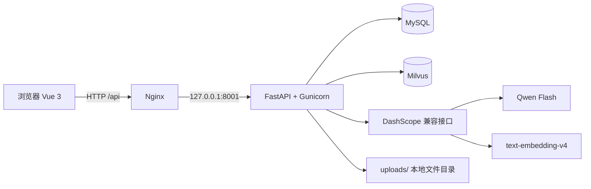

# BidFlow 项目完整说明

> 项目名称：BidFlow —— AI 招投标文件智能编制与合规核查平台  
> 文档版本：1.0  
> 代码基线：`bugfix/startup-bootstrap` 分支  
> 适用范围：当前 MVP 实现、开发联调与 Ubuntu 云服务器部署

## 1. 项目定位

BidFlow 面向企业投标团队，将“阅读招标文件、拆解要求、检索企业资料、撰写响应、人工审核、风险核查”串成一个可追溯的工作流。

当前 MVP 的核心原则是：**AI 草稿必须绑定企业资料来源；没有可引用资料时不调用大模型，而是进入人工补充状态。**

### 1.1 解决的问题

| 传统痛点 | BidFlow 的处理方式 |
|---|---|
| 招标文件篇幅长，关键要求容易遗漏 | 上传并解析文档，抽取为可逐项处理的需求清单 |
| 企业资质、案例材料分散 | 上传资料、解析分块、写入 Milvus 向量库并支持语义检索 |
| 响应内容难以证明依据 | 草稿保存引用来源，前端可检索并带入来源 |
| P0 资格项、空响应项容易漏审 | 合规规则自动标记高风险和中风险项 |
| 多轮修改没有统一视图 | 项目、需求、草稿、合规报告均按项目与用户隔离保存 |

### 1.2 端到端业务闭环

```text
注册/登录
  → 创建投标项目
  → 上传招标文件（TXT / PDF / DOCX）
  → 解析并抽取需求项（P0 / P1 / P2）
  → 上传企业资料并向量化
  → 检索相关资料
  → 生成带来源的响应草稿或转人工补充
  → 人工编辑、审核完成
  → 运行合规核查并导出 Markdown 报告
```

## 2. 技术架构



| 层级 | 技术 | 职责 |
|---|---|---|
| 前端 | Vue 3、Vite、Axios | 登录、项目工作台、资料上传、草稿编辑、合规报告展示 |
| 网关 | Nginx | 托管 `frontend/dist`，将 `/api`、`/docs`、`/redoc`、`/openapi.json` 反向代理到后端 |
| 后端 | FastAPI、Gunicorn、Uvicorn Worker | REST API、JWT 鉴权、业务编排、文件处理 |
| 关系数据 | MySQL、SQLAlchemy Async、asyncmy | 用户、项目、文档、需求、草稿、风险项 |
| 向量检索 | Milvus 2.x、pymilvus | 企业资料的向量写入、按用户隔离检索、删除同步 |
| 大模型 | OpenAI Python SDK + DashScope 兼容模式 | Qwen 草稿生成与 `text-embedding-v4` 向量生成 |

## 3. 项目目录与职责

```text
BidFlow/
├── backend/
│   ├── app/
│   │   ├── main.py                 # FastAPI 应用、生命周期、健康检查
│   │   ├── api/                    # 路由、鉴权依赖
│   │   ├── core/                   # 环境变量、JWT、异常处理
│   │   ├── db/                     # 异步 SQLAlchemy 引擎与建表逻辑
│   │   ├── models/                 # MySQL ORM 模型
│   │   ├── schemas/                # 请求/响应契约
│   │   └── services/               # 解析、RAG、草稿、合规等业务服务
│   ├── tests/                      # 自动化测试
│   └── requirements.txt            # Python 依赖
├── frontend/
│   ├── src/App.vue                 # 当前 MVP 的主工作台界面
│   ├── src/api/                    # Axios API 封装
│   ├── src/components/             # 后续拆分使用的组件目录
│   └── package.json
├── deploy/
│   ├── bidflow.service             # systemd 后端服务定义
│   └── nginx-bidflow.conf          # Nginx 站点配置
├── docs/
│   ├── deployment.md               # 云服务器部署说明
│   └── 项目完整说明.md             # 本文档
├── .env.example                    # 环境变量模板
├── Dockerfile
└── docker-compose.yml
```

## 4. 角色与权限边界

当前代码以“注册用户”为最小权限单位；每个项目、需求、文档、草稿都通过 `owner_id` 或项目归属进行校验。界面中的投标专员、技术负责人、审核负责人是业务角色描述，不是独立 RBAC 表。

| 业务角色 | 当前可完成的工作 |
|---|---|
| 投标专员 | 创建项目、上传招标文件、处理需求项、生成和编辑草稿 |
| 技术负责人 | 上传企业资质/案例/产品资料，作为检索和草稿依据 |
| 审核负责人 | 标记草稿完成、运行合规核查、导出 Markdown 报告 |

## 5. 核心业务设计

### 5.1 招标文件解析与需求提取

1. 用户向项目上传 `.txt`、`.pdf`、`.docx` 文件，单文件上限为 20 MB。
2. 文件保存到 `uploads/`，数据库记录文件名、路径、类型、大小与状态。
3. 解析器提取段落；PDF 使用 `PyPDF2`，DOCX 使用 `python-docx`。
4. 需求提取器按标题或约 300 字文本块聚合，按关键词分类为“资格、商务、技术、评分、其他”。
5. 优先级规则：资格/评分或出现“必须、强制、资格、废标、截止”等词时标为 P0；技术/商务及相关关键词通常标为 P1；其余为 P2。
6. 每条需求保存来源文本与来源位置，便于人工回看。

### 5.2 企业资料 RAG

1. 用户上传企业案例、资质、产品资料。
2. 服务解析并切分资料，生成可追溯文本块。
3. 使用 `text-embedding-v4` 调用 DashScope 生成向量。
4. 向量写入 Milvus，字段包含 `owner_id`、`document_id`、文件名、内容和来源位置。
5. 检索时按当前用户的 `owner_id` 过滤，返回内容、文件名、来源位置、相似度。
6. 删除企业资料时，同步删除该资料在 Milvus 中的向量。

### 5.3 响应草稿生成

| 条件 | 系统行为 |
|---|---|
| 没有检索资料 | 返回 `needs_manual`；正文为“待人工补充”；不调用大模型 |
| 有检索资料 | 调用 Qwen 生成草稿，保存来源，状态为 `pending_review` |
| 模型无有效输出 | 返回 `needs_manual`，保留来源并提示人工补充 |
| 人工编辑 | 保存 `edited_content`，可更新草稿状态 |
| 标记为 `completed` | 必须已有来源；无来源时接口返回 422 `SOURCE_REQUIRED` |

Prompt 约束包括：仅依据给定资料，不虚构资质、案例、金额、承诺或无法核实的内容。

### 5.4 合规核查规则

核查规则为确定性程序规则，不将风险等级交给大模型判断。每次核查会先清理该项目历史风险，再重新生成，避免同一问题重复累积。

| 规则编号 | 触发条件 | 风险等级 | 建议 |
|---|---|---|---|
| `P0_RESPONSE_MISSING` | P0 需求项状态不是 `completed` | 高 | 补充响应并完成审核 |
| `RESPONSE_CONTENT_EMPTY` | 非上述情况但响应正文为空 | 高 | 补充可审核内容 |
| `RESPONSE_SOURCE_MISSING` | 响应有内容但没有来源 | 中 | 补充企业资料引用 |
| `MANUAL_MATERIAL_REQUIRED` | 草稿状态为 `needs_manual` | 中 | 上传资质、案例或技术资料 |

报告输出包含总需求数、已完成数、待审核数、完成率、高中低风险列表，并支持导出 Markdown。

## 6. 数据模型

| 表 | 关键字段 | 说明 |
|---|---|---|
| `users` | `id`、`username`、`password_hash`、`is_active` | 注册用户；用户名唯一 |
| `bid_projects` | `owner_id`、`name`、`tenderer`、`deadline`、`budget`、`status` | 投标项目主表 |
| `tender_documents` | `project_id`、`filename`、`file_path`、`file_type`、`status` | 招标文件与解析状态 |
| `requirements` | `project_id`、`content`、`source_ref`、`priority`、`status` | 从招标文件抽取的逐项要求 |
| `company_documents` | `owner_id`、`filename`、`file_path`、`status` | 企业资料元数据；向量正文在 Milvus |
| `responses` | `requirement_id`、`ai_content`、`edited_content`、`source_refs`、`status` | AI 草稿、人工修改与引用来源 |
| `compliance_issues` | `project_id`、`requirement_id`、`rule_code`、`level`、`status` | 合规核查生成的风险项 |

主要关联关系：一个用户拥有多个项目和企业资料；项目拥有多个招标文件、需求和风险项；招标文件拥有多个需求；一个需求可关联草稿与风险项。

## 7. API 说明

所有业务接口前缀均为 `/api`。除注册和登录外，均需携带：

```http
Authorization: Bearer <access_token>
```

### 7.1 认证

| 方法 | 地址 | 请求要点 | 说明 |
|---|---|---|---|
| POST | `/api/auth/register` | `username`(3-50)、`password`(6-128) | 注册用户，成功返回 201 |
| POST | `/api/auth/login` | 用户名、密码 | 返回 `access_token` 和 `token_type` |
| GET | `/api/auth/me` | Bearer Token | 返回当前用户信息 |

### 7.2 项目与招标文件

| 方法 | 地址 | 说明 |
|---|---|---|
| GET | `/api/projects?skip=0&limit=20&status=` | 项目列表，含需求数、风险数、完成率 |
| POST | `/api/projects` | 创建项目：名称、招标单位、截止日期、预算、描述 |
| GET | `/api/projects/{project_id}` | 查看项目详情 |
| PATCH | `/api/projects/{project_id}` | 修改项目字段或状态 |
| DELETE | `/api/projects/{project_id}` | 删除项目及级联数据 |
| POST | `/api/projects/{project_id}/tender-documents` | `multipart/form-data` 上传招标文件 |
| POST | `/api/tender-documents/{document_id}/parse` | 解析文件并生成需求项 |
| GET | `/api/projects/{project_id}/tender-documents` | 查询项目文件列表 |
| GET | `/api/tender-documents/{document_id}` | 查询单个文件 |
| DELETE | `/api/tender-documents/{document_id}` | 删除文件与记录 |

项目、文件和需求相关的成功响应多数采用：

```json
{"code": 0, "message": "success", "data": {}}
```

### 7.3 需求项与草稿

| 方法 | 地址 | 说明 |
|---|---|---|
| GET | `/api/projects/{project_id}/requirements` | 支持 `category`、`status`、`priority`、`keyword` 筛选 |
| GET | `/api/requirements/{requirement_id}` | 获取单个需求项 |
| PATCH | `/api/requirements/{requirement_id}` | 更新内容、类别、优先级、状态、负责人、来源 |
| POST | `/api/responses/generate` | 请求体：`requirement_id`、`sources`，生成或覆盖草稿 |
| GET | `/api/responses/{requirement_id}` | 获取该需求的草稿 |
| PATCH | `/api/responses/{requirement_id}` | 保存人工修改内容和草稿状态 |

`sources` 每项字段为：`content`、`filename`、`source_ref`、`score`。无来源时草稿将进入 `needs_manual`。

### 7.4 企业资料与检索

| 方法 | 地址 | 说明 |
|---|---|---|
| POST | `/api/company-documents` | 上传企业资料、解析、向量化入库 |
| GET | `/api/company-documents` | 列出当前用户企业资料 |
| DELETE | `/api/company-documents/{document_id}` | 删除资料及其向量 |
| POST | `/api/company-documents/search` | 请求体：`query`、`top_k`(1-10)，返回相关文本块 |

### 7.5 合规报告

| 方法 | 地址 | 说明 |
|---|---|---|
| POST | `/api/compliance/projects/{project_id}/run` | 执行核查并返回报告 |
| GET | `/api/compliance/projects/{project_id}/report` | 重新计算并返回报告 |
| GET | `/api/compliance/projects/{project_id}/report.md` | 导出 Markdown 文本 |

运行中的 Swagger 文档位于 `/docs`，OpenAPI JSON 位于 `/openapi.json`。

## 8. 前端说明

当前 MVP 使用 `frontend/src/App.vue` 实现单页工作台，Axios 的基础地址为 `/api`。开发环境由 Vite 将 `/api` 代理到 `http://127.0.0.1:8001`；生产环境由 Nginx 代理。

前端数据流：

1. 登录成功后将 Token 保存为 `localStorage.bidflow_token`。
2. Axios 请求拦截器自动加入 `Authorization: Bearer <token>`。
3. 首页加载项目列表和企业资料列表。
4. 选择项目后上传招标文件并调用解析接口。
5. 选择需求后优先使用人工补充来源；若为空则调用企业资料检索，再请求草稿生成。
6. 可保存草稿、标记完成、运行合规核查和打开 Markdown 报告链接。

`src/views/`、`src/components/`、`src/router/`、`src/stores/` 当前主要用于后续组件化拆分，其中部分文件仅有任务注释；实际已运行的 MVP 主界面以 `App.vue` 为准。

## 9. 配置说明

配置文件位于 `backend/.env`，从项目根目录 `.env.example` 复制生成。真实 `.env` 不提交 Git。

| 变量 | 用途 |
|---|---|
| `MYSQL_HOST`、`MYSQL_PORT` | MySQL 地址与端口 |
| `MYSQL_USER`、`MYSQL_PASSWORD`、`MYSQL_DATABASE` | 业务数据库账号与库名 |
| `SECRET_KEY` | JWT 签名密钥 |
| `ACCESS_TOKEN_EXPIRE_MINUTES` | Token 有效期，默认 60 分钟 |
| `MILVUS_HOST`、`MILVUS_PORT`、`MILVUS_COLLECTION_NAME` | Milvus 连接与集合名 |
| `DASHSCOPE_API_KEY` | 百炼兼容接口密钥 |
| `DASHSCOPE_BASE_URL` | 默认 `https://dashscope.aliyuncs.com/compatible-mode/v1` |
| `LLM_MODEL_NAME` | 默认 `qwen-flash-2025-07-28` |
| `EMBEDDING_MODEL`、`EMBEDDING_DIMENSION` | 默认 `text-embedding-v4`、`1024` |

## 10. 本地运行与测试

### 10.1 后端

```powershell
cd C:\Users\lzj\Documents\简历模板\BidFlow\BidFlow\backend
python -m pip install -r requirements.txt
uvicorn app.main:app --reload --port 8001
```

接口地址：`http://127.0.0.1:8001/docs`。

### 10.2 前端

```powershell
cd C:\Users\lzj\Documents\简历模板\BidFlow\BidFlow\frontend
npm.cmd install
npm.cmd run dev
```

前端地址：`http://127.0.0.1:5173`。

### 10.3 自动化验证

```powershell
cd C:\Users\lzj\Documents\简历模板\BidFlow\BidFlow\backend
python -m pytest tests -q

cd ..\frontend
npm.cmd run build
```

当前后端测试覆盖认证、项目 CRUD、招标文件上传解析、需求筛选更新、草稿生成约束和合规规则。真实 MySQL、Milvus、DashScope 联调需要有效的 `.env` 配置。

## 11. 云服务器部署

完整步骤见 [deployment.md](deployment.md)。部署结构为：Nginx 提供前端静态文件，systemd 管理 Gunicorn，Gunicorn 仅监听 `127.0.0.1:8001`。

关键检查命令：

```bash
systemctl status bidflow nginx --no-pager
curl http://127.0.0.1:8001/api/health
ss -ltnp | grep -E ':80|:8001'
journalctl -u bidflow -n 100 --no-pager
```

### 常见部署问题

| 现象 | 原因 | 处理方式 |
|---|---|---|
| 浏览器访问公网 IP 超时 | 安全组或服务器防火墙未放行 TCP 80 | 放行入方向 TCP 80，并访问 `http://公网IP/` |
| 浏览器访问 `https://公网IP` 失败 | 当前 Nginx 仅配置 HTTP，未配置证书 | 使用 `http://`；如需 HTTPS，另行配置域名与证书 |
| Nginx 返回 502 | 后端未监听 8001 | 查看 `journalctl -u bidflow` 与健康检查 |
| `No module named pkg_resources` | pymilvus 2.5.3 与新版 setuptools 不兼容 | 安装 `setuptools<81`，随后重启 `bidflow` |
| `Access denied for user ...@172.17.0.1` | MySQL 在 Docker 中，应用经宿主机映射连接，账号未授权 Docker 网桥来源 | 创建应用专用账号并授予 `bidflow.*` 权限，更新 `.env` 后重启服务 |
| 草稿生成提示资料不足 | 未上传资料或检索无结果 | 上传企业资料，或由人工补充来源内容 |

## 12. 当前边界与后续迭代

已实现的是面向演示和小组项目的 MVP，适合展示完整业务闭环。以下能力属于后续可迭代项，不应误认为当前已完成：

- 细粒度 RBAC 与组织/团队协作权限；
- OCR 扫描件识别、复杂表格和图片解析；
- 异步任务队列、解析进度推送与大文件断点续传；
- 草稿版本历史、多人协同编辑、审批流；
- HTTPS、域名、备份、监控告警与生产级密钥管理；
- 将前端 `App.vue` 拆分为 `views`、`components`、状态管理模块。

## 13. 演示建议

1. 注册一个测试账号并登录。
2. 创建“某信息化系统建设项目”。
3. 上传一份包含资格、商务、技术要求的 TXT 招标文件并解析。
4. 上传企业案例或资质资料，展示资料入库和检索结果。
5. 选择 P0 需求项，生成带来源的草稿并人工保存为完成。
6. 故意保留一个 P0 项未完成，运行合规核查，展示高风险。
7. 打开或导出 Markdown 审查报告。

该演示能够完整体现“文档解析 + RAG + 大模型草稿 + 人工审核 + 规则核查”的项目价值。
